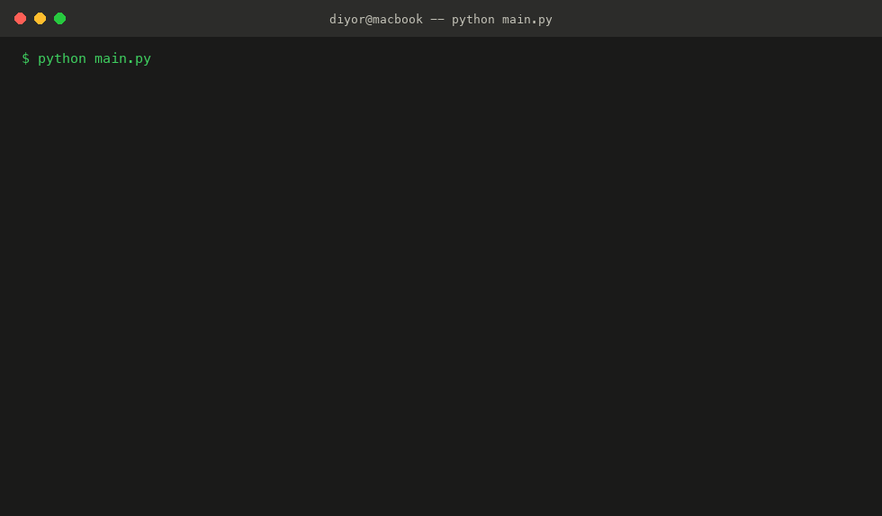
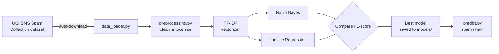
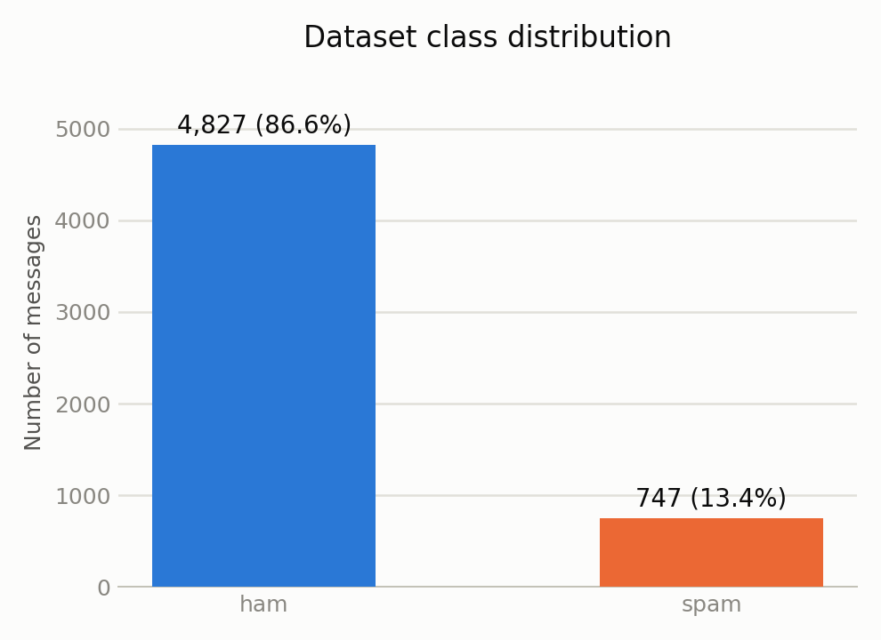
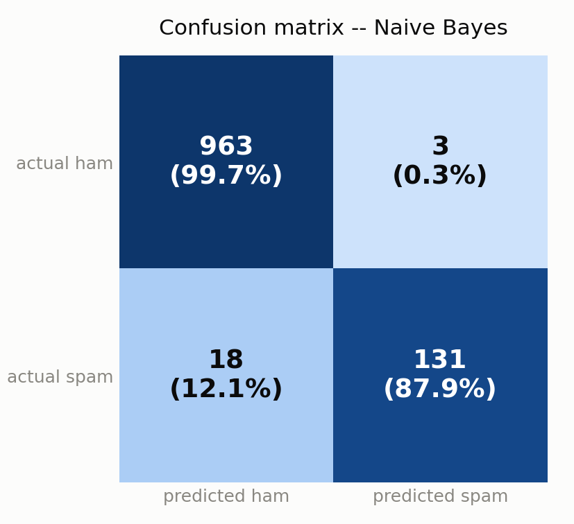
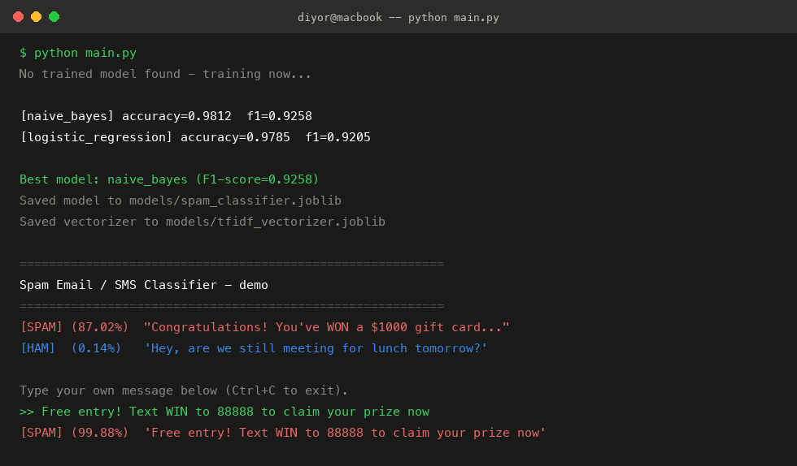

# Spam Email Classifier

[](https://github.com/UmirzakovD/spam-email-classifier/actions/workflows/ci.yml)
[](https://www.python.org/)
[](LICENSE)

A production-style, end-to-end machine learning project that classifies SMS/email
messages as **spam** or **ham** (legitimate). Built with scikit-learn, TF-IDF
features, and a clean, modular, fully tested codebase.



## Features

- **Zero manual setup** — the dataset downloads automatically on first run
- Text preprocessing pipeline: lowercasing, URL/number stripping, punctuation
  removal, tokenization, stopword filtering
- TF-IDF feature extraction (unigrams + bigrams)
- Two models trained and compared: **Multinomial Naive Bayes** vs.
  **Logistic Regression**; the best one (by F1-score) is saved automatically
- Full evaluation: accuracy, precision, recall, F1-score, confusion matrix
- CLI prediction tool + interactive demo, both runnable with a single command
- 13 unit tests covering preprocessing, training, and prediction (offline, no network needed)
- EDA notebook for exploring the dataset
- CI pipeline (GitHub Actions) running the test suite on every push, across Python 3.10–3.12

## How it works



## Project Structure

```
spam-email-classifier/
├── .github/workflows/ci.yml   # CI: runs the test suite on every push
├── assets/                    # README images (charts, demo gif/screenshot)
├── data/                      # Dataset folder (auto-populated on first run)
│   └── README.md              # Dataset source & citation
├── notebooks/
│   └── eda.ipynb               # Exploratory data analysis
├── scripts/
│   └── generate_assets.py     # Dev utility that (re)builds the assets/ images
├── src/
│   ├── data_loader.py         # Downloads & caches the dataset
│   ├── preprocessing.py       # Text cleaning / tokenization
│   ├── train.py                # Trains, evaluates, and saves the best model
│   └── predict.py              # Loads the model and classifies new text (CLI)
├── models/                    # Saved model + vectorizer (auto-populated)
├── tests/                     # Unit tests (pytest)
├── main.py                    # Single-command entry point
├── requirements.txt
├── LICENSE
└── .gitignore
```

## Dataset

[SMS Spam Collection](https://archive.ics.uci.edu/dataset/228/sms+spam+collection)
from the UCI Machine Learning Repository — 5,574 real, labeled SMS messages.
See [`data/README.md`](data/README.md) for the full citation. The dataset is
downloaded and cached automatically the first time you run the project — no
manual download, no Kaggle account, no API key.



The dataset is imbalanced (86.6% ham / 13.4% spam), which is why the models
below are compared on **F1-score**, not accuracy alone.

## Quick Start

```bash
git clone https://github.com/UmirzakovD/spam-email-classifier.git
cd spam-email-classifier
pip install -r requirements.txt
python main.py
```

That's it. `main.py` downloads the dataset, trains and compares both models
(or reuses a previously saved model), prints sample predictions, and drops
you into an interactive prompt to try your own messages.

## Installation

Requires Python 3.10+.

```bash
python -m venv .venv
source .venv/bin/activate        # Windows: .venv\Scripts\activate
pip install -r requirements.txt
```

## Usage

**Run everything with one command:**

```bash
python main.py
```

**Train only** (re-trains and overwrites the saved model):

```bash
python -m src.train
```

**Predict on a single message:**

```bash
python -m src.predict "Congratulations! You've WON a free prize, click now!"
# [SPAM] (spam probability: 99.88%)  '...'
```

**Predict interactively:**

```bash
python -m src.predict
```

**Use it as a library:**

```python
from src.predict import predict

result = predict("Hey, are we still on for lunch tomorrow?")
print(result)  # {'label': 'ham', 'spam_probability': 0.0031}
```

## Results

Evaluated on a stratified 80/20 train/test split (test set: 1,115 messages).

| Model                    | Accuracy | Precision | Recall | F1-score |
|---------------------------|:--------:|:---------:|:------:|:--------:|
| **Naive Bayes** (best)    | 0.9812   | 0.9776    | 0.8792 | 0.9258   |
| Logistic Regression        | 0.9785   | 0.9085    | 0.9329 | 0.9205   |



The best model (highest F1-score) is selected and saved automatically by
`src/train.py`. Full metrics, including the confusion matrix and per-class
report, are written to `models/metrics.json` after each training run.

## Demo

```
$ python main.py
[naive_bayes] accuracy=0.9812  f1=0.9258
[logistic_regression] accuracy=0.9785  f1=0.9205

Best model: naive_bayes (F1-score=0.9258)

[SPAM] (87.02%)  "Congratulations! You've WON a $1000 gift card..."
[HAM]  (0.14%)   'Hey, are we still meeting for lunch tomorrow?'

>> Free entry! Text WIN to 88888 to claim your prize now
[SPAM] (99.88%)  'Free entry! Text WIN to 88888 to claim your prize now'
```

See the full animated demo at the top of this README, or a static version:



## Testing

```bash
pytest tests/ -v
```

Unit tests cover text preprocessing, model training/evaluation logic, and
prediction, using small synthetic data so they run fully offline and finish
in under a second. CI runs the same suite on every push across Python
3.10, 3.11, and 3.12.

## Regenerating the README assets

The charts and terminal mockups under `assets/` are generated from real
project output (real dataset stats, real metrics, real predictions) by
`scripts/generate_assets.py`. It's a dev-only utility, not required to run
the classifier:

```bash
pip install -r requirements.txt pillow   # matplotlib is already in requirements.txt
python -m src.train                       # produces models/metrics.json
python scripts/generate_assets.py
```

## Tech Stack

Python, pandas, scikit-learn, joblib, matplotlib, pytest, Jupyter.

## License

MIT — see [LICENSE](LICENSE).
